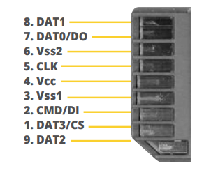

# VIP - **V**HDL **I**mage **P**rocessing

**Dedicated repository for final project of CPE-487 "Digital System Design.**

Team Members:

- Amein Almoughrabi - [`Personal Website`](https://sites.google.com/view/ameinalmoughrabi)
- Michael Dasaro - [`Personal Website`](https://sites.google.com/stevens.edu/mdasarocpe487/home)
- Eugene Kozlakov - [`Personal Website`](https://sites.google.com/view/genek/home)

## **Project Overview**

The goal of our project was to write a VHDL program to our board that would perform basic image processing. This amounted to: 1) reading an image file in binary form written to the logical disk of an SD card; 2) saving what was read to memory on-board the Nexys A7-100T; and 3) outputting what was in memory onto a screen via a VGA cable. We decided that any further changes and processing to our image would be a post-end goal.+
We used valued resources, such as [`GitHub`](https://github.com/EKozlakov/DSDFP) and [`Google Sites`](https://sites.google.com/view/dsdfpgroup10/), to document code and weekly logs of the project.

## **Current State of our code**

Our current code is capable of locating an example binary file on our computer running Vivado, read through the file, and import its contents into the block RAM of the simulator. This process is detailed below, and this is what the simulator's block RAM looks like: 

  

## **Documentation of Progress and Research**
### **Reading Files**

Our first challenge for this project was deciding how to read in the image file so that we could perform our analysis and processing on it. We discovered that, using VHDL, and image *cannot* be read in compressed image filetypes like .png or .jpg. It is only possible to load an image onto an FPGA by converting it into raw binary or hex code, writing it to a .mif (Memory Initialization File). Thus we have decided to focus on reading in image files that have been converted to raw binary/hex.

**Bitstream vs. SD Card**
We did a lot of research and experimentation on whether to store the image files on a computer running Vivado or on an SD card plugged into the FPGA board. Here's what we found:

- Storing files on a computer running Vivado

  - Storing the files on the computer would allow us to retreive files using a bitstream, process them, then return them.
  - Assuming everything works, only a file location is needed to access it, and Vivado will access it.
  - A downside is that the FPGA board needs to be tethered to a computer to perform the processing, but the upside is that files can quickly be edited and examined on the computer.
  
- Storing files on an SD card
  - Storing files on an SD card proved to be a far more complicated task. The FPGA doesn't have support for a file system, so the information would have to be written to the Logical Disk of an SD card. We accomplished this using [HxD made by Mael Horz](https://mh-nexus.de/en/hxd/). A tutorial for how to do some basic writing raw hex to an SD Card is shown [here](***TODO** write da tutorial*).
  - The data could theoretically be read directly with the memory address on the SD card.
  - Unfortunately, the pin assignment for the SD card is extremely complex, and required a proprietary library that was not available with our license: [logiSDHC SD Card Host Controller by Xylon d.o.o.](https://www.xilinx.com/products/intellectual-property/1-1p025g.html).
  - Additionally, we referenced the SD Association's Simplified Specifications for the Physical Layer of their SD Cards. All of the SD Association's simplified specifications are available in the "Simplified Specifications" under the "downloads" section of their website, [here](https://www.sdcard.org/downloads/pls/). An image of a Standard SD card's pins/contact pads is shown below. Image is courtesy of Cactus Labs.

  
*Pinouts of a Standard SD Card. The pins are the exact same on the microSD version.*  
  
*The 'SD Card Host Controller' IP Core was unavailable to us with our current license, making it difficult to implement a pre-defined, well-constructed controller.*  

#### **Writing to the Block RAM**

Writing to the Block RAM (BRAM) in our project was a difficult challenge that we only began to make progress on near the end of the semester. We began our highly-experimental BRAM implementation using the on-board Block Memory Generator available in the Vivado IP Catalog, creating Simple Dual Port (SDP) RAM blocks. A diagram explaining how the SDP BRAM pins are laid out is shown below. The guide we followed to achieve this is the [Vivado Block Memory Generator v8.4 Logicore IP Product Guide](https://www.xilinx.com/support/documentation/ip_documentation/blk_mem_gen/v8_4/pg058-blk-mem-gen.pdf), available at the link.  

    
  *Simple Dual-Port RAM diagram, courtesy of Vivado Block Memory Generator v8.4 LogiCORE IP Product Guide*
  
### **Problems Encountered**

<!--It all started when VHDL was born
and its parents didn't even show up-->

**Development Problems**

- Our first problem was overestimating how easy it would be to edit files on the FPGA board in VHDL
  - Once the information is loaded into an array, we're confident that VHDL can easily sort through it and check each color value to see if it falls in the specified color range, then sort out the desired colors
  - The issues are with getting to the point where the information is loaded into block RAM, and with saving or displaying the results
  - Simply put, both of these were far more complicated than we expected and took the majority of our time during this project
    - We were successful in loading data into the block RAM in the Vivado board simulation with our testbench, but didn't quite get to the point of a successful bitstream to the physical board. This was because we struggled with assigning the physical pins in our constraint file.
    - We believe our code for displaying information on the 7-segment displays is functional, but we didn't get to the point where we could test it
    - We would have liked to been able to display the resultant image out to a VGA display, or to save the processed file onto the sd card or send it back through the bitstream to the host computer, but didn't have time to pursue either very far
- A relatively minor issue we had was with the filetype of the image we wanted to process. We didn't expect it to be easy to process a .png or .jpg file, and theorized that a raw RGB file would be easy to parse. Unfortunately, even this proved harder than expected, so for testing purposes we've been using a simple file with binary numbers, with the goal of displaying these numbers on the 7-segment display, possibly after processing them and checking for ranges.
  
**Project-Management Problems**

- Lack of scope
  - One problem that hindered us the most during the development of this project, was the fact that we didn't understand the scope of what we wanted to accomplish, and how big it *truly* was.
  - Consequently, we regularly had to redefine what we wanted to achieve in the current week, given the abundance of problems due to our lack of extensive experience in VHDL and the strongly-typed nature of the language.
- No "Plan of Attack"
  - Given our underestimation of the difficulty of our goal, we jumped into the project blindly. As mentioned before, we didn't work out exact plans as to what should be accomplished each week. We also did not organize how our project should be structured in terms of coding and the different layers of VHDL projects.
  - As a result, we had misconstrued ideas about the difficulties of different aspects of the project. This resulted in setbacks which led us to an incomplete project.
- Lack of understanding
  - Due to our lack of a deeper understanding of VHDL, this resulted in us choosing a project for which we didn't understand the scope, as mentioned above.
  - Although this issue is clear as day, it is important to note how complex some functions and behaviors get in VHDL, even for goals that seem simple to achieve. Had we had a deeper understanding of VHDL

## Potential Outline for Future Groups
<!-- i will make this an ordered/numbered list-->
- Note: Please use this list as a springboard on getting started. There are several ways to complete this task, and the ideas listed below are meant to push the reader(s) in the right direction.

1. Generate memory initialization files to load onto FPGA board.  
  1.1. One method of achieving this task is "Inferring Memory" in your source code. We did not expriment with this method of memory loading as we pursued method 1.2. However, if implemented correctly, you can sidestep having to use Block RAM generator found in Vivado's Xilinx IP Catalog. There is Core Generator/Block Memory Generator IP available through Vivado that allows for more control over how your memory initialization is loaded into your board's BRAM.  <!--i will check license availability-->
   1.2 We highly advise to do a lot of your own research on memory inference in particular. Below are a just a few starters on memory inference and several starting examples:
    - ['What does memory inference mean?'](https://www.edaboard.com/threads/what-does-memory-inference-mean.123138/)
    - ['Stackoverflow Example Code on how to infer ram in VHDL'](https://stackoverflow.com/questions/57435602/vhdl-correctly-way-to-infer-a-single-port-ram-with-synchronous-read)  
   1.3. Accomplishing this is already a massive step in the right direction, as it is a difficult task all on its own. After completing this, with a proof of functionality, you could call this your whole project.
2. Prove that memory has been initialized
   2.1. Proving that something has been actually pushed to your board would be the next step in the project. This can likely be done through simulations, or outputting certain symbols to the LED decoders as a "proof-of-concept."
3. Fully output an image through VGA cable to a monitor   
   3.1. After proving that your board has been initialized with some starting memory, outputting whatever has been written to memory would be the next big step. This would require reading from the inferred BRAMs, and sending these results through a VGA cable. We advise sticking to monochrome/black and white images to avoid having to deal with the 3 RGB channels and their different value. However, given we haven't reached this point in our own project, it would be best to reference the ['VGA Ball'](https://github.com/kevinwlu/dsd/tree/master/Nexys-A7/Lab-3) lab provided in this class when trying to figure out how to approach this problem.

### Resources

- [`https://www.fpga4student.com/`](https://www.fpga4student.com/)
- [`https://stackoverflow.com/`](https://stackoverflow.com/)
- [`https://embdev.net/topic/471055`](https://embdev.net/topic/471055)
- [`https://mh-nexus.de/en/hxd/`](https://mh-nexus.de/en/hxd/)
- [`https://www.nandland.com/articles/block-ram-in-fpga.html`](https://www.nandland.com/articles/block-ram-in-fpga.html)
- [`https://www.cactus-tech.com/wp-content/uploads/2019/03/An-Introduction-To-SD-Card-Interface.pdf`](https://www.cactus-tech.com/wp-content/uploads/2019/03/An-Introduction-To-SD-Card-Interface.pdf)
- [`https://www.sdcard.org/downloads/pls/`](https://www.sdcard.org/downloads/pls/)
- [`https://www.ics.uci.edu/~jmoorkan/vhdlref/Synario%20VHDL%20Manual.pdf`](https://www.ics.uci.edu/~jmoorkan/vhdlref/Synario%20VHDL%20Manual.pdf)
- [`https://forums.xilinx.com/`](https://forums.xilinx.com/)
- [``]()